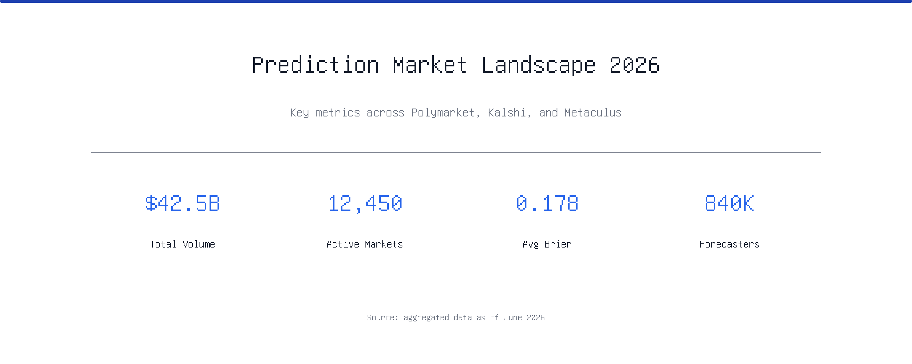
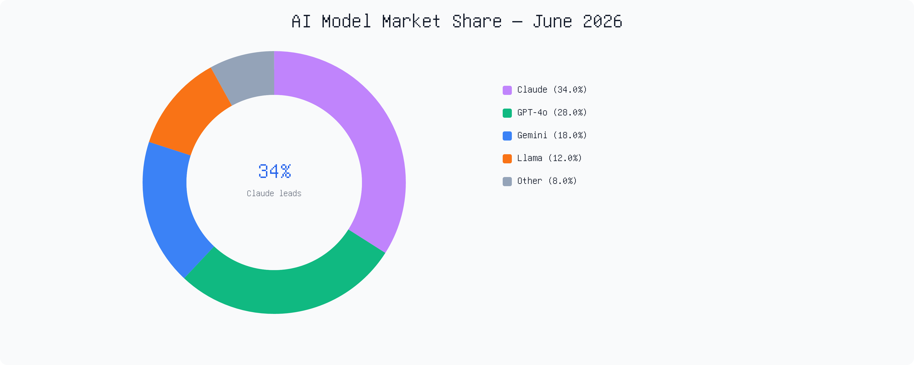

# Infographic Generator

[](LICENSE)

Claude Skill for rendering editorial infographics from structured JSON specs. Produces SVG → PNG at 2× resolution via [resvg-js](https://github.com/thx/resvg-js). Optionally assembles PNG banners into `.docx` documents.

Built for integration with Claude Projects / Claude Skills — feed it a visual spec, get a production-ready infographic.

| Hero banner | Donut chart |
|:-----------:|:-----------:|
|  |  |

## Features

- **4 layout presets**: hero banner, donut chart, quick-card, side-by-side comparison
- **2× resolution** rendering (2000×800 → 4000×1600 PNG)
- **Custom fonts** — Gelasio (serif), Inter (sans), DejaVu Sans Mono
- **SVG templates** — `scripts/templates.js` generates the intermediate SVG in memory; the CLI writes PNG output
- **Docx assembly** — combine markdown + PNG banners into a Word doc

## Install

```bash
npm install
```

Use Node.js 18+ to render and Node.js 20+ to run the regression tests. With Bun, `bun install --frozen-lockfile` uses the committed dependency versions.

### Fonts (optional)

Place `.ttf` files in `fonts/`:
- `Gelasio-Regular.ttf`, `Gelasio-Bold.ttf`
- `Inter-Regular.ttf`, `Inter-SemiBold.ttf`
- `DejaVuSansMono.ttf`

Without custom fonts, system fonts are used as fallback.

## Usage

### Render an infographic

```bash
node scripts/render.js examples/spec.example.json output.png
```

### Layout presets

**`hero`** — full-width banner with title, subtitle, key metrics
```json
{
  "layout": "hero",
  "content": {
    "title": "...",
    "subtitle": "...",
    "metrics": [{ "label": "Users", "value": "1.2M" }],
    "footer": "Source: ..."
  }
}
```

**`donut`** — donut chart with legend and center callout
```json
{
  "layout": "donut",
  "content": {
    "title": "...",
    "segments": [{ "label": "A", "value": 40, "color": "#2563eb" }],
    "callout": { "value": "40%", "label": "A leads" }
  }
}
```

**`quick-card`** — compact reference card with bullet points
```json
{
  "layout": "quick-card",
  "content": {
    "title": "...",
    "items": ["Point one", "Point two"],
    "note": "footnote"
  }
}
```

**`comparison`** — side-by-side comparison columns
```json
{
  "layout": "comparison",
  "content": {
    "title": "A vs B",
    "columns": [
      { "name": "Option A", "items": ["Fast", "Cheap"] },
      { "name": "Option B", "items": ["Reliable", "Scalable"] }
    ]
  }
}
```

### Assemble .docx

```bash
node scripts/assemble-docx.js report.md banner1.png banner2.png report.docx
```

### JSON Spec structure

Every spec includes:

```json
{
  "layout": "hero",
  "palette": {
    "primary": "#1e40af",
    "secondary": "#6b7280",
    "accent": "#2563eb",
    "background": "#ffffff",
    "text": "#111827"
  },
  "typography": {
    "title": { "family": "Gelasio", "size": 56 },
    "body": { "family": "Inter", "size": 24 }
  },
  "dimensions": { "width": 2000, "height": 800 },
  "content": { "..." }
}
```

## Known Gotchas

Specs require positive integer dimensions (at most 8192 per side and 16777216 source pixels), hex colors, and positive finite font sizes. Donut values must be finite and nonnegative with a positive total. Invalid specs fail before rasterization. Text is escaped before insertion into SVG.

DOCX assembly recognizes Markdown headings (`#` through `######`) and plain text. Other Markdown syntax is retained as text. Images are inserted as 600×240 banners; use that aspect ratio to avoid stretching.

1. **docx lineRule** — always set `lineRule: "exact"` or `"atLeast"` explicitly. LibreOffice misrenders without it.
2. **Unicode arrows** — Gelasio lacks `→` glyph. Always use ASCII `->`.
3. **Image vs line height** — in docx, paragraph line height must accommodate inline images.

## Installing as a Claude Skill

Copy the skill into your Claude project:

```bash
# Claude Code / Claude Projects
cp -r infographic-skill/ .claude/skills/infographic/

# Or reference directly in your project config
```

The `SKILL.md` file tells Claude how to use `render.js` to generate infographics from JSON specs.

## Roadmap

- [ ] Additional presets: timeline, funnel, kanban
- [ ] Animated SVG → GIF export
- [ ] Claude tool API wrapper
- [ ] Template gallery

## Testing

```bash
npm test
```

Tests render all four presets, check hostile attributes and invalid chart values, verify PNG dimensions, and inspect heading styles in generated DOCX output.

## License

MIT
